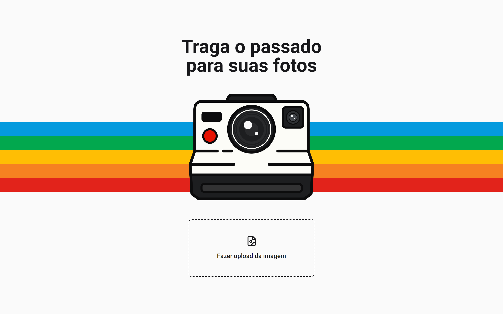

# Polaroider


## :bookmark: **Sumário**
- [Sobre o Projeto](#camera_flash-sobre-o-projeto)
- [Visual do Projeto](#art-visual-do-projeto)
- [Tecnologias](#wrench-tecnologias)
- [Configurações e Instalação](#rocket-configurações-e-instalação)
- [Licença](#balance_scale-licença)

## :camera_flash: **Sobre o Projeto**

Uma aplicação que transforma suas fotos em polaroids, com um estilo retrô e vintage. Este é um projeto criado para ser demonstrado no meu trabalho final da disciplina de Matemática Aplicada a Multimídia, do curso de Sistemas e Mídias Digitais da Universidade Federal do Ceará.

<p align="center">
   <a href="https://polaroider.vercel.app">Veja o projeto completo aqui.</a>
</p>

## :art: **Visual do Projeto**




## :wrench: **Tecnologias**

Tecnologias utilizadas no projeto.

### **Construção do site**

- [TypeScript](https://www.typescriptlang.org)
- [Next 13 (App Router)](https://nextjs.org)
- [Radix UI](https://www.radix-ui.com)
- [Cropper.js](https://fengyuanchen.github.io/cropperjs/)

### **Estilização**

- [Tailwind CSS](https://tailwindcss.com)
- [Lucide Icons](https://lucide.dev)

### **IDE, Versionamento e Deploy**

- [Visual Studio Code](https://code.visualstudio.com)
- [Git](https://git-scm.com)
- [GitHub](https://github.com)
- [Vercel](https://vercel.com/)

## :rocket: **Configurações e Instalação**

### Requisitos

- [Node](https://nodejs.org/) e um gerenciador de pacotes, usei [pnpm](https://pnpm.io/pt/).

```zsh
# Caso não tenha o pnpm, execute:
npm install -g pnpm
```

Recomendo que veja a [documentação de configuração do Next](https://nextjs.org/docs/getting-started/installation).

```zsh
# Clonando o projeto
git clone https://github.com/davsilvam/polaroider.git

# Instalando as dependências
pnpm install

# Compilar e abrir o programa para desenvolvimento
pnpm dev

# Compilar e minificar para produção
pnpm build
```

## :balance_scale: **Licença**

Esse projeto está sob a [licença MIT](https://github.com/davsilvam/polaroider/blob/main/LICENSE.md).

---

Feito com 💙💚💛🧡❤️ e ☕ por <a href="https://www.linkedin.com/in/davsilvam/">David Silva</a>.

> [Portfólio](https://davidsilvam.vercel.app) &nbsp;&middot;&nbsp;
> GitHub [@davsilvam](https://github.com/davsilvam) &nbsp;&middot;&nbsp;
> Instagram [@davsilvam_](https://www.instagram.com/davsilvam_/)
